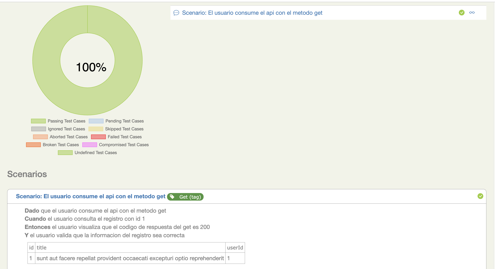
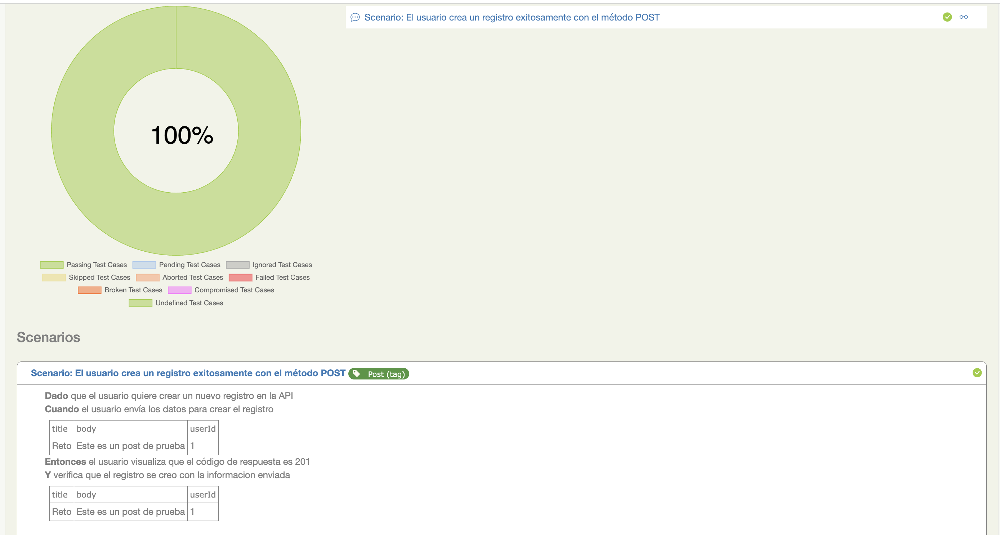
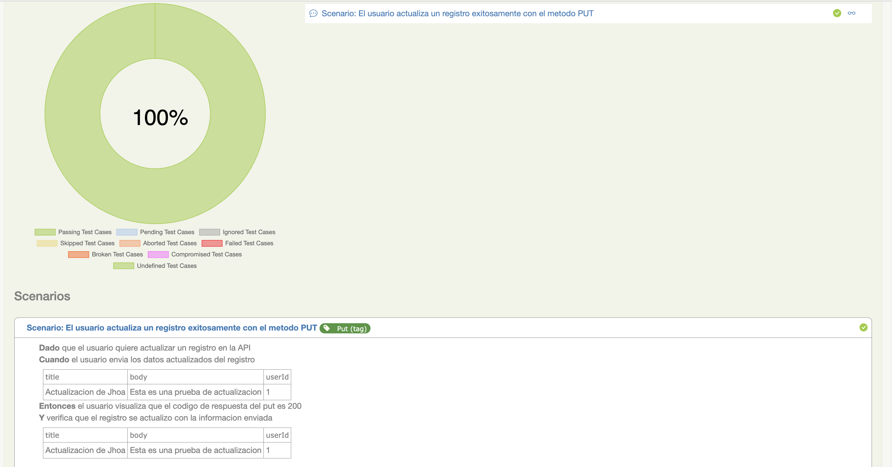
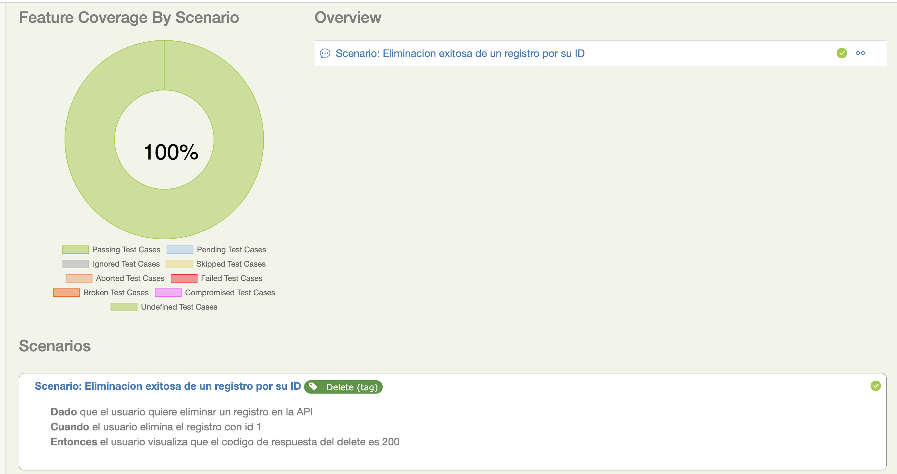
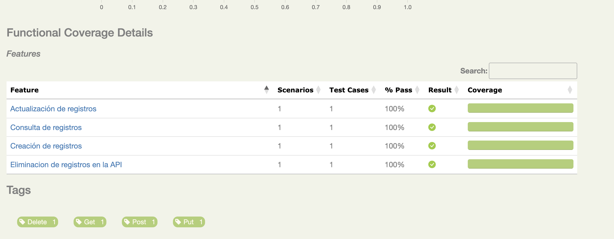
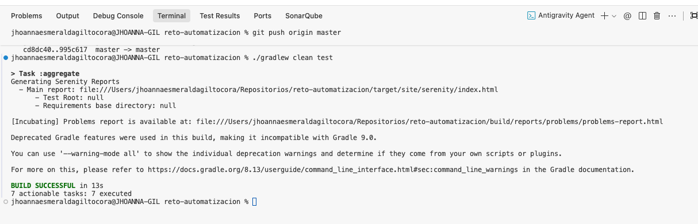

# QA REST Screenplay Challenge - Jhoa

##  Descripción y Contexto

Este repositorio contiene la automatización del **Reto de QA**, el cual consiste en la implementación de pruebas automatizadas para validar los cuatro métodos principales (GET, POST, PUT, DELETE) de una API REST.

Para este reto, se utiliza la API de pruebas: [JSONPlaceholder](https://jsonplaceholder.typicode.com/).

###  Tecnologías Core
La solución está implementada bajo el patrón de diseño **Screenplay**, utilizando:
* **Serenity BDD** como framework de automatización.
* **JUnit 5** como motor de ejecución.
* **Gradle** como gestor de dependencias.

###  Endpoints Validados
Se han automatizado escenarios de prueba para los siguientes recursos:
- `GET` `/posts/{id}` - Consulta de un registro específico.
- `POST` `/posts` - Creación de un nuevo registro.
- `PUT` `/posts/{id}` - Actualización completa de un registro existente.
- `DELETE` `/posts/{id}` - Eliminación de un registro.

## Tecnologías
El proyecto está construido con las siguientes tecnologías:

- Java: Versión instalada: 21.0.2-tem
- Gradle: Versión instalada: 8.13 Herramienta de automatización de compilación y gestión de dependencias.
- Serenity BDD: Framework de pruebas de código abierto que ayuda a escribir pruebas de aceptación de alta calidad y genera reportes detallados.
    - Core: Motor principal para la gestión de estados y reportes.
    - Screenplay Pattern: Patrón de diseño que aplica principios SOLID para crear pruebas automatizadas
    - Screenplay REST: Extensión de Serenity que facilita el consumo de servicios web (API REST) integrándose de forma nativa con Rest-Assured.
- JUnit 5 (Jupiter): La versión más reciente del framework de pruebas unitarias para Java, encargada de la ejecución y orquestación de los escenarios de prueba.
- Lombok: Biblioteca de Java utilizada para reducir el código redundante. Permite automatizar la creación de Getters, Setters y Constructores
- Jackson Databind: Librería para el manejo de JSON. Se utiliza para la serialización (convertir objetos Java a JSON) y deserialización (convertir respuestas JSON a objetos Java) de los cuerpos de las peticiones API.


## Estructura del Proyecto

El proyecto se ha desarrollado siguiendo el patrón de diseño Screenplay, promoviendo principios SOLID y una clara separación de responsabilidades para garantizar un código mantenible, escalable y legible:

```text
src
├── main
│   └── java
│       └── com.challenge
│           ├── config        # Configuración dinámica de ambientes
│           ├── constants     # Endpoints centralizados en Enums
│           ├── interactions  # Acciones de bajo nivel (POST, GET, PUT)
│           ├── models        # POJOs (Request/Response) con Lombok
│           ├── questions     # Validaciones de las respuestas (Assertions)
│           └── tasks         # Pasos de alto nivel (Lógica de negocio)
└── test
    ├── java
    │   └── com.challenge
    │       ├── runners       # Clases para ejecutar los tests
    │       └── stepdefinitions # Mapeo de Gherkin a código Java
    └── resources
        ├── features          # Archivos .feature (Escenarios Cucumber)
        └── serenity.conf     # Configuración central de Serenity
```

Bajo el patrón Screenplay, las responsabilidades se dividen de la siguiente manera:

- interactions: Representan el "Cómo" el Actor interactúa con el sistema.
- tasks: Representan el "Qué" hace el Actor. Orquestan una o más interacciones para completar un flujo de negocio (ej. CrearRecurso).
- questions: Se utilizan para realizar las verificaciones. Consultan el estado de la respuesta para validarla (ej. TheResponseBody, TheStatusCode).
- models: POJOs que representan la estructura de datos de la API. Usan @Builder de Lombok para facilitar la creación de objetos y Jackson para el mapeo JSON.
- constants: Uso de Enums para centralizar las rutas de los recursos (Endpoints) y evitar el uso de cadenas de texto "quemadas".
- serenity.conf: Archivo de configuración para manejar múltiples ambientes y propiedades globales sin modificar el código fuente.

##  Ejecución y Reportes

###  Comandos de Ejecución
Utiliza los siguientes comandos desde la terminal para interactuar con el proyecto:


| Acción | Comando |
| :--- | :--- |
| **Limpiar y ejecutar todas las pruebas** | `./gradlew clean test` |
| **Ejecutar pruebas (sin limpiar)** | `./gradlew test` |
| **Generar reporte HTML de Serenity** | `./gradlew aggregate` |
| **Abrir reporte en el navegador (macOS)** | `open target/site/serenity/index.html` |
| **Ejecutar solo pruebas GET** | `./gradlew clean test -Dcucumber.filter.tags="@GET"` |
| **Ejecutar solo pruebas POST** | `./gradlew clean test -Dcucumber.filter.tags="@POST"` |
| **Ejecutar solo pruebas PUT** | `./gradlew clean test -Dcucumber.filter.tags="@PUT"` |
| **Ejecutar solo pruebas DELETE** | `./gradlew clean test -Dcucumber.filter.tags="@DELETE"` |


## Evidencias de Ejecución








**Link de la ultima ejecución:** 

file:///Users/jhoannaesmeraldagiltocora/Repositorios/reto-automatizacion/target/site/serenity/index.html


**comando ./gradlew clean test pasando:**

